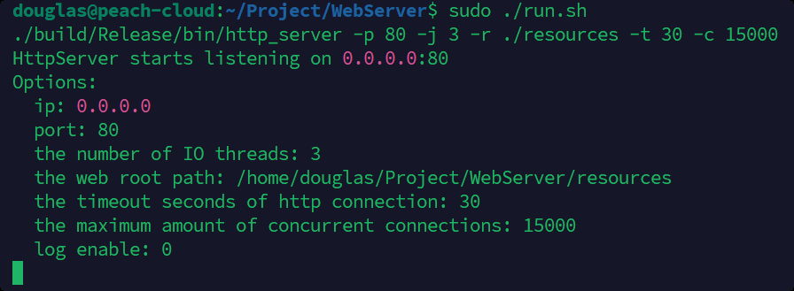
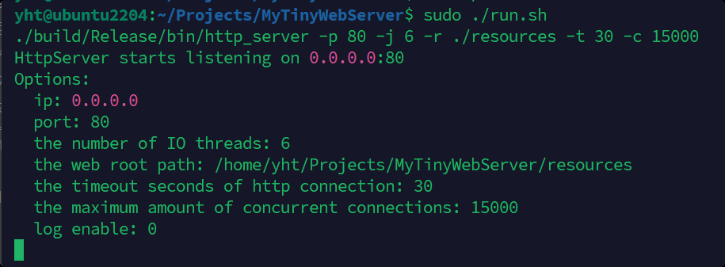
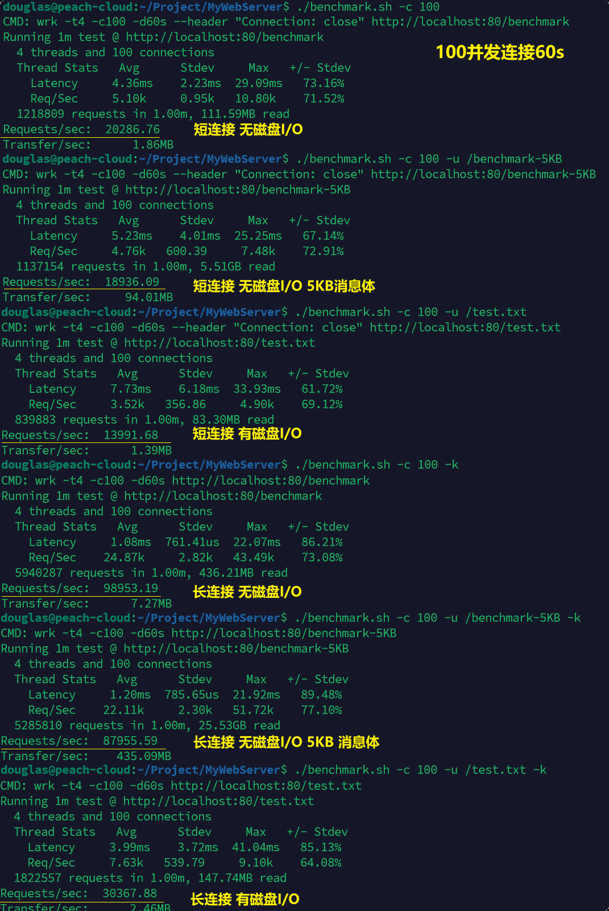

# WebServer 

## 1.1 项目介绍
- 参照 muduo 库实现底层 **网络库** 部分
  - 包括：Reactor 模块、异步日志模块、通用定时器、TCP 缓冲区、TCP Server部分，同时去除 boost 依赖。

- 补充实现 **Tiny HTTP/1.1 服务器**：
   - 可解析 GET/HEAD 请求，响应静态资源文件；
   - 可响应 200、400、403、404、500、501 状态码。
   - 支持长、短连接; 支持剔除超时的空闲连接

<br>

## 1.2 技术要点

- **Reactor 并发模型**
	- **多 Reactor & 多线程**，"**one loop per thread**" 方案: 每个线程运行一个事件循环, 主线程作为Acceptor, 从线程负责IO
	- **I/O 多路复用**： 非阻塞 IO + epoll（水平触发 LT)
	- **事件驱动**，统一事件源：通用定时器基于单个 timerfd 实现，IO 线程间通过 eventfd 进行异步通知
- **基于红黑树的通用定时器**  + **利用 "时间轮" 方式断开超时的空闲连接**
	- 通用定时器（微秒级计时）基于 `std::set` 管理，支持 $O(\log n)$ 插入 & 查找 & 移除既有定时器；
	- 基于通用定时器，采用时间轮的方式完成 HTTP 空闲连接的超时断开（秒级计时）
	  - （避免为每个连接启用一个独立的通用 Timer，开销略大）
	
- **异步日志模块**：基于双缓冲区的高效异步日志
  - 支持开启/关闭日志输出，可指定输出到日志文件或 stdout
  - 支持不同日志级别：TRACE、INFO、DEBUG、WARN、ERROR、FATAL
  - 支持日志滚动：按天滚动 &  单份文件写满指定 rollsize 后滚动，即换新日志文件
  - 支持指定日志文件名、日志目录、单份日志文件大小上限（rollsize）

- **独立的 TCP 接收/发送缓冲区**：epoll 水平触发下，保证数据交付
- **基于主-从状态机实现的 HttpParser**：针对不完整的 HTTP 报文，可通过多次解析保证有效结果；

<br>

项目整体参照 muduo 库，以 C++14 实现，**OOP 风格**，**各模块的功能边界划分清晰**，且无第三方库依赖。

该项目仅作为个人学习网络编程的入门练手项目。  
开发过程中的 **详细实现说明** 可参见个人博客：XXXXXXX。

<br>

## 1.3 主体框架

=> 此处插入图


多 Reactor & 多线程，"one loop per thread" 方案，即主线程 & 各个 IO 线程上**分别运行一个独立的事件循环**。

- 主线程即 Main Reactor：仅负责 **accept** 请求，以 Round-Robin 方式将连接分发&绑定到各个 I/O 线程。
- I/O线程即 subReactor：负责其所管理的 TCP 连接上的所有I/O事件。

<br>

### 模块划分

- Http 模块
	- HttpServer 类
	- HttpConnection 类
	- HttpParser 类
	- HttpMessage 基类 以及 HttpRequest & HttpResponse 子类
- Tcp 模块
	- TcpServer 类、Acceptor 类
	- TcpConnection 类、Buffer 类
- Reactor 模块
	- EventLoop 类、EventLoopThread、EventLoopThreadPool 类
	- Epoller 类
	- Channel 类
- 异步日志模块
	- 日志前端：
		- Logger 类、LogStream 类
	- 日志后端：
		- AsyncLogger 类
		- LogFile 类、AppendFile 类
		- FixedBuffer 类
- 定时器模块
	- TimingWheel 类
	- TimeManager 类
	- Timer 类
	- Timestamp 类
	
- 辅助部分
  - 线程封装：Thread 类、CurrentThread 命名空间
  - Any 类
  - countDownLatch 类
  - InetAddress 类

<br>

## 1.4 目录说明

项目根路径下包含以下目录：

- `src` ：项目的所有源代码和头文件。
- `test`：开发过程中的测试代码（其中有 4个基于 GoogleTest 的单元测试）
- `include`：项目中所有头文件的符号链接（这里集中存放主要是方便配置 VSCode 的代码提示）
- `resources`：Web 资源目录（这里直接用了 @项目里的资源文件，包括html文件、图片、视频文件等）
- `.vscode`：VSCode 配置文件。
- `.VSCodeCounter`："VS Code Counter" 插件生成的代码量统计结果。

<br>


## 1.5 开发环境

- C++ 14
- g++ 11.4.0
- CMake 3.22.1
- GoogleTest
- Ubuntu 22.04.3 LTS
- VSCode

<br>
<br>

# 2. 编译运行

## 2.1 Build

```shell
./build.sh [--debug | --preset <name> | --clean | --test | --help]
```

默认构建类型为 Release，仅生成 httpserver，构建目录为 `build`， 选项说明：

- `--debug`：构建类型为 Debug
- `--preset <name>`：根据 `CMakePresets.json` 中指定 Preset 项进行构建
- `--test`：构建 `test` 目录下的所有测试文件
- `--clean`：删除构建目录

<br>

## 2.2 Run

```shell
./run.sh [--debug | --gdb] 
```

默认运行构建 Release 版本，选项说明： 

- `--debug`：运行构建目录下的 Debug 版本
- `--gdb`： 启动 gdb 调试构建目录下的 Debug版本

`run.sh` 中可修改传给程序的参数（已指定默认值），包括：

- 服务器相关：
	- IP 地址 & 端口号
	- Web 资源根目录
	- I/O 线程数量（为0时，主线程兼做I/O线程；大于0时，主线程仅做 Accpter，各 I/O线程负责IO）
	- HTTP 超时时间（s）
	- 允许的最大并发连接数量
	
- 日志相关
	- 是否输出日志
	- 日志级别
	- 日志文件名（为空时输出到 stdout，非空时将开启 AsyncLogger 异步写入到日志文件）
	- 日志生成目录
	- 日志文件滚动大小（即单份日志文件的字节上限，写满后自动切换新文件）
	- 日志刷新间隔（从日志缓冲区 flush 到日志文件的间隔；除定期刷新外，缓冲区写满后也会触发刷新）

<br>

## 2.3 压测
注：需要安装压测工具 wrk （Ubuntu下可 `sudo apt install wrk`),  该脚本只是简化命令输入。
```shell
./benchmark.sh [-t <n>] [-c <n>] [-d <n>] [-p <port>] [-u <url>] [-k]
```
- `-t <n>`: wrk的线程数
- `-c <n>`: wrk维持的并发连接数量
- `-d <n>`: wrk压测持续时间(s)
- `-p <port>`: 请求的端口号. 默认80
- `-u <url>`: 请求的资源路径, 例如`/index.html`。固定访问`http://localhost`。
- `-k`: 启用长连接(默认短连接)

<br>
<br>


# 3. 代码统计

代码统计通过 VSCode 中的 "VS Code Counter" 插件完成，统计结果保存于 `.VSCodeCounter` 路径下。

分别对 **`src`目录** (源文件&头文件) 以及 **`test`目录** (测试程序) 进行了统计, 结果如下图。

单份文件的具体代码量可见 `.VsCodeCounter/*/details.md` 。

<br>


<br>
<br>


# 4. 压测

## 4.1 测试环境

测了两个环境: 

- 阿里云服务器 ECS：2核 2G； Ubuntu 22.04.4 LTS
- 笔记本电脑上运行的VMware虚拟机: 8核 8G;   Ubuntu 22.04.3 LTS
	- (笔记本CPU是 Intel 酷睿 i7-14700HX)

测两个环境是因为云服务器CPU只有2核, 跑压测时wrk本身占一半, 故对WebServer的多线程性能体现不明显。而虚拟机环境下磁盘I/O性能又太差。


## 4.2 测试工具

开源 HTTP 压测工具 wrk——https://github.com/wg/wrk

## 4.3 测试方法

### 4.3.1 测试说明

服务器设置：

- 线程设置:
	- 云服务器环境: 共 4 线程：1 主线程 + 3 个IO线程
	- 虚拟机环境: 共 7 线程: 1 主线程 + 6 个IO线程
- 关闭日志输出功能
- 保留 HTTP 超时定时器

wrk使用：

- 排除网络带宽影响，走本地环回地址，访问 `localhost:80`
- 分别测试 100、1000、10000 并发连接下的性能
- 为确认性能影响因素, 共考虑了六种情况 :  (短连接/长连接) , (有/无磁盘IO),  消息体大小
	1. 为确定磁盘I/O的影响，请求 `/benchmark` 时将直接回发 "Hello Word!" 消息体，不请求文件；
	2. 为验证程序层面的TCP发送缓冲区交付能力, 请求 `/benchmark-5KB` 时将直接回发 5KB 的消息体, 不请求文件.
	3. 请求 `/test.txt` 时，将访问磁盘上资源路径下的 `resources/test.txt` 文件，以其作为消息体回传。
	（文件内容为  `"This is a test file."`, 共20字节）


### 4.3.2 服务器运行参数

云服务器环境下: 




<br>

虚拟机环境下:  




### 4.3.3 wrk 命令

以维持1000并发连接持续60s为例，几种情况的wrk运行命令如下：

| 连接类型 | 磁盘I/O | 消息体大小 | 命令行                                                       |
| -------- | ------- | ---------- | ------------------------------------------------------------ |
| 短连接   | ×       | 12B        | `wrk -t4 -c1000 -d60s --header "Connection: close" http://localhost:80/benchmark` |
| 短连接   | ×       | **5KB**    | `wrk -t4 -c1000 -d60s --header "Connection: close" http://localhost:80/benchmark-5KB` |
| 短连接   | √       | 20B        | `wrk -t4 -c1000 -d60s --header "Connection: close" http://localhost:80/test.txt` |
| 长连接   | ×       | 12B        | `wrk -t4 -c1000 -d60s http://localhost:80/benchmark`         |
| 长连接   | ×       | **5KB**    | `wrk -t4 -c1000 -d60s http://localhost:80/benchmark-5KB`     |
| 长连接   | √       | 20B        | `wrk -t4 -c1000 -d60s http://localhost:80/test.txt`          |


<br>

## 4.4 测试结果（QPS）

### 4.4.1 阿里云服务器环境

阿里云服务器 ECS：2核 2G； Ubuntu 22.04.4 LTS

WebServer 共 4 线程: 1 主线程 + 3 个IO线程

| 连接类型 | 磁盘I/O | 消息体大小 | 100 并发连接 (60s) | 1000 并发连接 (60s) | 10000 并发连接(10s) |
| -------- | ------- | ---------- | ------------------ | ------------------- | ------------------- |
| 短连接   | ×       | 12B        | 2 W                | 1.95 W              | 1.65 W              |
| 短连接   | ×       | **5KB**    | **1.89 W**         | **1.67 W**          | **1.46 W**          |
| 短连接   | √       | 20B        | 1.39 W             | 1.3 W               | 1.11 W              |
| 长连接   | ×       | 12B        | 9.89 W             | 8.8 W               | 6.8 W               |
| 长连接   | ×       | **5KB**    | **8.79 W**         | **7.23 W**          | **6.28 W**          |
| 长连接   | √       | 20B        | 3 W                | 2.8 W               | 2.69 W              |

说明：

- 5KB消息体下, 维持1000并发连接时, 短连接QPS 1.67W, 长连接 QPS 7.23W, 约为前者4倍。

<br>

### 4.4.2 虚拟机环境

笔记本电脑上运行的VMware虚拟机: 8核 8G;   Ubuntu 22.04.3 LTS  
(笔记本CPU是 Intel 酷睿 i7-14700HX)

 WebServer 共 7 线程: 1 主线程 + 6 个IO线程

| 连接类型 | 磁盘I/O | 消息体大小 | 100 并发连接 (60s) | 1000 并发连接 (60s) | 10000 并发连接(10s) |
| -------- | ------- | ---------- | ------------------ | ------------------- | ------------------- |
| 短连接   | ×       | 12B        | 4.62 W             | 6.97 W              | 6.88 W              |
| 短连接   | ×       | **5KB**    | **4.64 W**         | **7.14 W**          | **6.29 W**          |
| 短连接   | √       | 20B        | 1 W                | 1 W                 | 1.3 W               |
| 长连接   | ×       | 12B        | 22 W               | 58 W                | 36 W                |
| 长连接   | ×       | **5KB**    | **21.8 W**         | **46.8 W**          | **28.6 W**          |
| 长连接   | √       | 20B        | 1.8 W              | 1.96 W              | 1.7 W               |

说明：

- 5KB消息体下, 维持1000并发连接时, 短连接QPS 7.4W, 长连接 QPS 46.8W, 约为前者6.5倍。
- 虚拟机上，磁盘I/O性能极低, 带磁盘I/O时 QPS 均仅有1W+

<br>


### 4.4.3 图片附录

压测运行结果的截图如下，各测试场景下所有请求均成功, wrk未报告失败, 故上表中QPS测试结果有效.

##### 阿里云服务器环境 100 并发连接 60s: 



##### 阿里云服务器环境 1000 并发连接 60s:


##### 阿里云服务器环境 10000 并发连接 10s: 


##### 虚拟机环境 100 并发连接 60s: 


##### 虚拟机环境 1000 并发连接 60s:


##### 虚拟机环境 10000 并发连接 10s: 


<br>
<br>

# 5. 致谢

- 由衷感谢 [@muduo](https://github.com/chenshuo/muduo)，参照其书本《Linux多线程服务端编程》和源码实现了网络库部分。
- 感谢 [@markpartice](https://github.com/markparticle/WebServer)，项目路径下的 `resources` 文件取自其项目, 也曾学习其实现。
- 感谢 [@qinguoyi](https://github.com/qinguoyi/TinyWebServer), [@linyacool](https://github.com/linyacool/WebServer/), [@hanAndHan](https://github.com/hanAndHan/HttpServer) 等前人的工作, 让初学者能够较快了解WebServer的功能与背后原理, 易于模仿实践入门。

初期阶段曾向多个 WebServer 小项目学习, 最后转向了muduo, 再次感谢muduo。
